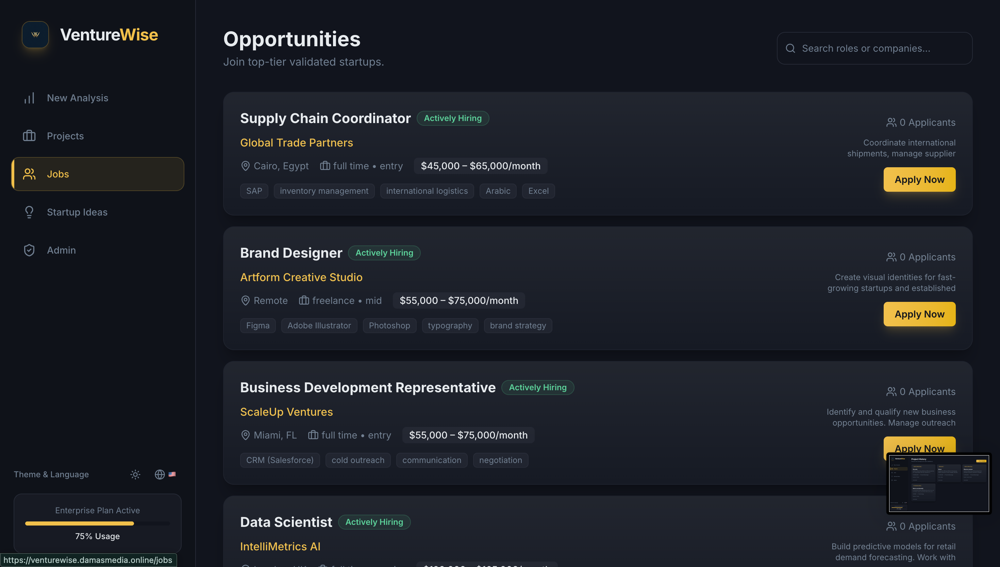
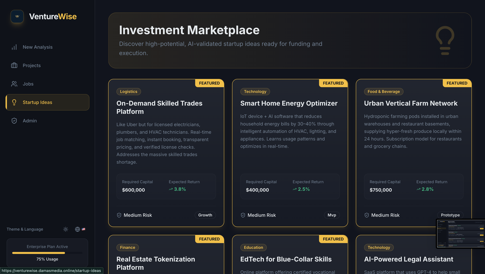
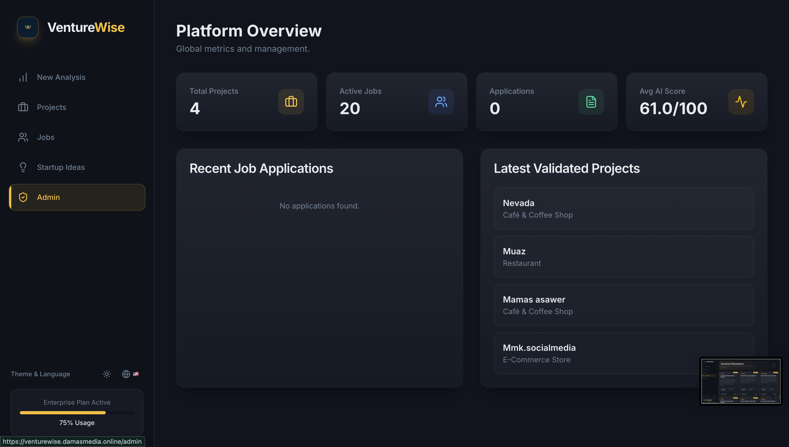

# VentureWise – Smart Business Analysis and Investment Platform

---

## Live Demo

The application is deployed online and fully functional.

You can access the live system here:

https://venturewise.damasmedia.online

The system is running on a production server and demonstrates a fully working full-stack web application.

All features can be tested directly through the web interface without installing the project locally.

---

## Project Description

VentureWise is a smart web platform designed to help entrepreneurs, investors, and job seekers make better business decisions.

The platform allows users to enter a business idea by specifying the category, location, and budget. The system then generates a detailed feasibility analysis including market demand, competition level, risk assessment, and revenue estimation.

In addition, the system provides:

- A job posting and job application system
- A startup ideas marketplace for funding
- An admin dashboard to manage system data

This project demonstrates full-stack web development using modern technologies and structured database design.

---

## Problem Statement

Many people have business ideas but lack the tools to evaluate whether their project will succeed.

Common challenges include:

- Lack of market knowledge
- Uncertainty about pricing and competition
- Difficulty finding employees
- Limited access to investors

VentureWise provides a centralized system that helps users analyze, plan, and launch business ideas more effectively.

---

## Key Features

### Business Analysis

- Evaluate business ideas
- Calculate success score
- Determine risk level
- Estimate expected revenue
- Analyze market demand
- Identify competition level

### Marketing and Branding

- Generate marketing strategy
- Suggest pricing plan
- Recommend brand names
- Provide logo concept ideas
- Suggest popular products

### Job Management System

- Admin can post jobs
- Users can apply for jobs
- Store applicant information
- Track application status

### Startup Ideas Marketplace

- Admin can add startup ideas seeking funding
- Users can browse investment opportunities

### Admin Dashboard

- Manage users
- Manage projects
- Add jobs
- Add startup ideas
- Control system data

---

## Technologies Used

Backend:

- Python  
- FastAPI  
- SQLAlchemy  
- Pydantic  

Frontend:

- React  
- Vite  
- JavaScript  
- HTML  
- CSS  

Database:

- SQLite (required database)
- Designed to support PostgreSQL as an advanced database option

Tools:

- GitHub  
- REST API architecture  

---

## System Architecture

The system is divided into three main layers:

1. Frontend Layer  
Handles user interface and interaction.

2. Backend Layer  
Handles API requests, business logic, and data processing.

3. Database Layer  
Stores structured data including users, projects, analyses, jobs, and startup ideas.

---

## Database Design

Main entities in the system:

- Users
- Projects
- Categories
- Locations
- Analyses
- Competitors
- PricingStrategies
- MarketingPlans
- BrandSuggestions
- Products
- Jobs
- Applicants
- Applications
- StartupIdeas

Relationships implemented:

User → Projects (One-to-Many)

Project → Analysis (One-to-One)

Projects ↔ Products (Many-to-Many)

Jobs → Applications (One-to-Many)

Applicants → Applications (One-to-Many)

---

## API Endpoints

Users:

POST /users  
GET /users  

Projects:

POST /projects  
GET /projects  
GET /projects/{id}  
DELETE /projects/{id}  

Analysis:

GET /analysis/{project_id}  

Marketing:

GET /marketing/{project_id}  

Branding:

GET /branding/{project_id}  

Products:

GET /products/{project_id}  

Jobs:

POST /jobs  
GET /jobs  
GET /jobs/{id}  

Applications:

POST /apply/{job_id}  

Startup Ideas:

POST /startup-ideas  
GET /startup-ideas  

Admin:

GET /admin/users  
POST /admin/job  
POST /admin/startup  
DELETE /admin/project/{id}  

---

## Project Structure

project/

backend/  
- main.py  
- database.py  
- models.py  
- schemas.py  
- routes/  
- services/  

frontend/  
- src/  
- components/  
- pages/  

screenshots/  

README.md  

requirements.txt  

---

## Screenshots

Below are screenshots of the running application:

### Home Page

---

### Project Analysis Result

---

### Jobs Page

Jobs Page

---

---
### project to investment 

project to investment 

--- 

### Admin Dashboard

---

## Bonus Implementation

The system database is structured to support PostgreSQL in addition to SQLite.

Advanced relationships such as Many-to-Many are implemented to improve scalability and meet bonus grading criteria.

---

## Future Improvements

- Integration with real business data APIs
- AI-based prediction models
- Advanced analytics dashboard
- User authentication system
- Real-time notifications

---

## Author

Students Name: mohanad kadadou 2309115218
tassnim ghellab 2309115423
ABDULSALAM BADR ABDULSALAM MANSOUR 220911449
Muhammet Muaz Bernieh 220911449 

University: Istinye University  

major : Software Engineering  

Project: Web Application Development
